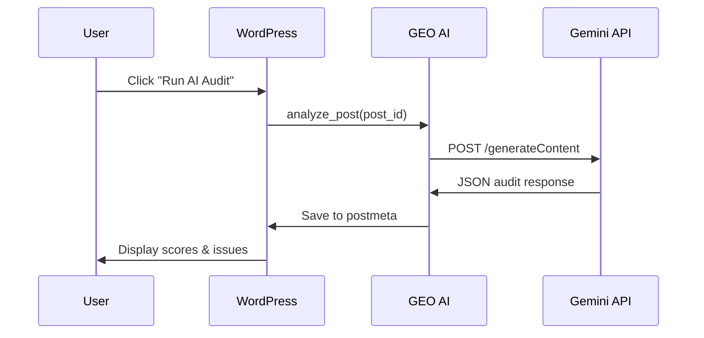

## Overview

The AI Audit feature uses **Google Gemini** to analyze your content for AI answer engines (Google AI Overviews, Perplexity, ChatGPT). Get actionable insights with transparent 4-dimensional scoring and automated quick fixes.

<Info>
  AI Audits evaluate content across 4 key dimensions: Answerability (40%), Structure (20%), Trust (25%), and Technical (15%).
</Info>

## How It Works

GEO AI analyzes your content by sending it to Google's Gemini API, which returns structured audit data including scores, issues, schema recommendations, and improvement suggestions.

### Audit Request Flow



## Running Your First Audit

<Steps>
  <Step title="Configure API Key">
    Navigate to **Settings → GEO AI → General** and enter your Google Gemini API key.
    
    <Tip>
      Get a free API key from [Google AI Studio](https://ai.google.dev/gemini-api/docs/api-key)
    </Tip>
  </Step>
  
  <Step title="Open the Editor">
    Edit any post or page in the Gutenberg block editor.
  </Step>
  
  <Step title="Access GEO AI Panel">
    Click the **GEO AI** icon in the editor sidebar (or select it from the **⋮** menu).
  </Step>
  
  <Step title="Run Audit">
    Click the **"Run AI Audit"** button and wait 10-15 seconds for analysis.
  </Step>
  
  <Step title="Review Results">
    See your 4-dimensional breakdown, identified issues, and suggested quick fixes.
  </Step>
</Steps>

## Understanding Audit Scores

### Score Breakdown

<CardGroup cols={2}>
  <Card title="Answerability" icon="bullseye">
    **Weight: 40%**
    
    Measures how well your content directly answers user queries. High scores indicate clear, concise answers that AI engines can extract.
  </Card>
  
  <Card title="Structure" icon="sitemap">
    **Weight: 20%**
    
    Evaluates content organization, headings, lists, and formatting. Well-structured content is easier for AI to parse.
  </Card>
  
  <Card title="Trust" icon="shield-check">
    **Weight: 25%**
    
    Assesses credibility signals like citations, author information, and factual accuracy. Trust signals boost AI visibility.
  </Card>
  
  <Card title="Technical" icon="code">
    **Weight: 15%**
    
    Checks schema markup, semantic HTML, and technical SEO elements. Proper markup helps AI understand context.
  </Card>
</CardGroup>

## Implementation Details

### Core Analysis Function

The analyzer uses the Gemini API with structured JSON output:

```php title="includes/class-geoai-analyzer.php" showLineNumbers startLineNumber="92"
public function analyze_post( $post_id ) {
    $post = get_post( $post_id );
    if ( ! $post ) {
        return new \WP_Error( 'invalid_post', __( 'Post not found.', 'geo-ai' ) );
    }

    // Check for API key
    $api_key = $this->get_api_key();
    if ( empty( $api_key ) ) {
        return new \WP_Error( 'no_api_key', __( 'Google Gemini API key not configured.', 'geo-ai' ) );
    }

    // Get rendered content
    $content = $this->get_rendered_content( $post );

    // Call Gemini API
    $audit_result = $this->call_gemini_api( $content, $api_key );

    if ( is_wp_error( $audit_result ) ) {
        return $audit_result;
    }

    // Save to postmeta
    update_post_meta( $post_id, '_geoai_audit', wp_json_encode( $audit_result ) );
    update_post_meta( $post_id, '_geoai_audit_timestamp', current_time( 'mysql' ) );

    return $audit_result;
}
```

### API Request Structure

```php title="includes/class-geoai-analyzer.php" showLineNumbers startLineNumber="151"
private function call_gemini_api( $content, $api_key ) {
    $prompt = $this->build_audit_prompt( $content );

    $response = wp_remote_post(
        $this->api_endpoint . '?key=' . $api_key,
        array(
            'timeout' => 45,
            'headers' => array(
                'Content-Type' => 'application/json',
            ),
            'body'    => wp_json_encode(
                array(
                    'systemInstruction' => array(
                        'parts' => array(
                            array(
                                'text' => 'You are GEO AI, a WordPress SEO assistant. Only respond with valid JSON that matches the requested schema.'
                            ),
                        ),
                    ),
                    'contents' => array(
                        array(
                            'parts' => array(
                                array( 'text' => $prompt ),
                            ),
                        ),
                    ),
                    'generationConfig' => array(
                        'temperature'     => 0.3,
                        'topK'            => 40,
                        'topP'            => 0.95,
                        'maxOutputTokens' => 2048,
                        'responseMimeType' => 'application/json',
                    ),
                )
            ),
        )
    );
}
```

### Expected Response Schema

Gemini returns structured JSON with the following format:

```json
{
  "scores": {
    "answerability": 85,
    "structure": 70,
    "trust": 80,
    "technical": 65,
    "total": 78
  },
  "issues": [
    {
      "id": "missing_tldr",
      "severity": "high",
      "msg": "Content lacks a concise TL;DR summary",
      "quickFix": "insert_answer_card"
    },
    {
      "id": "no_citations",
      "severity": "med",
      "msg": "Add authoritative citations to boost trust",
      "quickFix": "add_citations"
    }
  ],
  "schema": {
    "article": true,
    "faq": false,
    "howto": false,
    "errors": []
  },
  "suggestions": {
    "titleOptions": [
      "How to Optimize WordPress for AI Search Engines",
      "Complete Guide to AI SEO for WordPress Sites"
    ],
    "entities": ["WordPress", "AI", "SEO", "Gemini"],
    "citations": [
      "https://example.com/source-1",
      "https://example.com/source-2"
    ]
  },
  "runAt": "2025-03-04T10:30:00+00:00"
}
```

## Auto-Run on Save

Enable automatic audits when publishing or updating content:

<Steps>
  <Step title="Enable Auto-Run">
    Go to **Settings → GEO AI → General**
  </Step>
  
  <Step title="Check the Option">
    Enable **"Run AI audit automatically when publishing or updating posts"**
  </Step>
  
  <Step title="Save Settings">
    Click **Save Changes**
  </Step>
</Steps>

<Warning>
  Auto-run audits consume API quota. Monitor your Gemini API usage if you publish frequently.
</Warning>

### Background Processing

When Action Scheduler is available, audits run asynchronously:

```php title="includes/class-geoai-analyzer.php" showLineNumbers startLineNumber="37"
public function maybe_auto_analyze( $post_id, $post ) {
    if ( wp_is_post_revision( $post_id ) || wp_is_post_autosave( $post_id ) ) {
        return;
    }

    if ( 'publish' !== $post->post_status ) {
        return;
    }

    $autorun = get_option( 'geoai_autorun_on_save', false );
    if ( ! $autorun ) {
        return;
    }

    // Queue background audit if Action Scheduler is available
    if ( function_exists( 'as_enqueue_async_action' ) ) {
        as_enqueue_async_action( 'geoai_background_audit', array( 'post_id' => $post_id ) );
        return;
    }

    // Fallback to running immediately
    $result = $this->analyze_post( $post_id );
}
```

## Quick Fixes

Quick fixes provide one-click solutions to common issues:

<AccordionGroup>
  <Accordion title="Insert Answer Card">
    **Issue:** Content lacks a concise TL;DR summary
    
    **Fix:** Automatically inserts the Answer Card block at the beginning of your content with AI-suggested summary.
  </Accordion>
  
  <Accordion title="Add Citations">
    **Issue:** Missing authoritative sources
    
    **Fix:** Suggests relevant citation URLs based on your content topic.
  </Accordion>
  
  <Accordion title="Improve Structure">
    **Issue:** Poor heading hierarchy or missing sections
    
    **Fix:** Recommends heading improvements and section organization.
  </Accordion>
  
  <Accordion title="Add Schema Markup">
    **Issue:** Missing or incomplete schema.org markup
    
    **Fix:** Enables appropriate schema types (Article, FAQ, HowTo) for your content.
  </Accordion>
</AccordionGroup>

## WP-CLI Commands

Audit posts from the command line:

<CodeGroup>

```bash Audit Single Post
wp geoai audit 123
```

```bash Audit All Posts
wp geoai audit all
```

```bash Audit with Filter
wp geoai audit all --min-score=80
```

</CodeGroup>

## Best Practices

<CardGroup cols={2}>
  <Card title="Audit Before Publishing" icon="check">
    Run audits on draft content to identify issues early in your workflow.
  </Card>
  
  <Card title="Monitor API Usage" icon="chart-line">
    Track your Gemini API quota usage to avoid unexpected charges or rate limits.
  </Card>
  
  <Card title="Address High-Severity Issues" icon="exclamation-triangle">
    Focus on fixing high-severity issues first for maximum impact on AI visibility.
  </Card>
  
  <Card title="Re-audit After Changes" icon="rotate">
    Run new audits after making significant content updates to verify improvements.
  </Card>
</CardGroup>

## Troubleshooting

<AccordionGroup>
  <Accordion title="Audit returns mock data">
    **Cause:** No API key configured or invalid key
    
    **Solution:** Add a valid Gemini API key in Settings → General and test the connection.
  </Accordion>
  
  <Accordion title="Request timeout">
    **Cause:** API response taking longer than 45 seconds
    
    **Solution:** Reduce content length (limit is 20,000 characters) or try again during off-peak hours.
  </Accordion>
  
  <Accordion title="API error 429">
    **Cause:** Rate limit exceeded
    
    **Solution:** Wait before retrying, or upgrade your Gemini API quota.
  </Accordion>
  
  <Accordion title="Invalid JSON response">
    **Cause:** Gemini returned malformed data
    
    **Solution:** The parser attempts to extract JSON from response. Check error logs for details.
  </Accordion>
</AccordionGroup>

## Related Features

<CardGroup cols={3}>
  <Card title="Answer Card" icon="square-info" href="./answer-card">
    Add TL;DR summaries with key facts
  </Card>
  
  <Card title="Schema Markup" icon="code" href="./schema">
    Configure JSON-LD structured data
  </Card>
  
  <Card title="Meta Titles" icon="heading" href="./meta-titles">
    AI-generated titles and descriptions
  </Card>
</CardGroup>